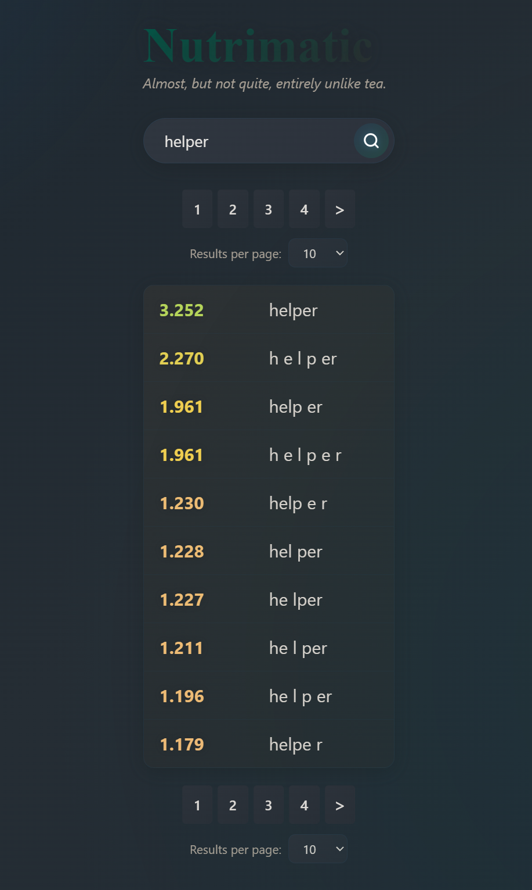

# 🚀 Nutri Helper

> A lightweight userscript that enhances [https://nutrimatic.org/](https://nutrimatic.org/).

##### English [中文](./README_zh.md)



---

🌟 Quick Install

Open the installation link below in your browser and your userscript manager will prompt you to install:

🔗 [https://github.com/KoolShow/nutri-helper-vue/releases/download/latest/nutri-helper.user.js](https://github.com/KoolShow/nutri-helper-vue/releases/download/latest/nutri-helper.user.js)

Supported managers:

- [Tampermonkey](https://www.tampermonkey.net/)
- [Violentmonkey](https://violentmonkey.github.io/)
- [ScriptCat](https://scriptcat.org/)
- ...

Installation steps:

1. Install a userscript manager extension in your browser.
2. Open the installation link above and confirm installation when prompted.
3. After enabling the script, visit [https://nutrimatic.org/](https://nutrimatic.org/) to see the enhancements.

Mobile users:

- Android: Use browsers that support userscripts such as [Kiwi Browser](https://github.com/kiwibrowser/src.next) or [Edge](https://edgemobileapp.microsoft.com/) ([Via](https://viayoo.com/) is not supported currently).
- iOS: Safari (not tested).

✨ Features

- Adds a convenient search and results list UI on nutrimatic.org
- Provides pagination controls for long result sets
- Lightweight frontend built with Vue 3 and distributed as a userscript

🛠 Development

Clone the repository and run the development or build scripts. The project uses Vite + Vue 3 + TypeScript.

```powershell
pnpm install
pnpm run dev      # start local dev server
pnpm run build    # build production userscript
```

⚙️ Build Notes

- Userscript configuration is defined in `vite.config.ts` using `vite-plugin-monkey`.
- The userscript header includes `downloadURL` and `updateURL` pointing to the GitHub releases URL above for install and auto-update.

🗺 Roadmap

- Polish the search results UI/UX
- Add a basic settings panel
- Add CI to automatically build and publish the userscript
- Internationalization: support more languages
- Add Wiki-card previews and quick-search jump links for results

🧩 Contributing

- Found a bug or have a feature suggestion? Please open an issue first.
- For PRs, branch from `main` (or your preferred branch) and run `npx ultracite fix` before committing to keep code style consistent.

📜 License

MIT — see the `LICENSE` file in the repository.

❤️ Credits

Styles used by this project are inspired by [the work of cl0vis403](https://github.com/cl0vis403/nutrimatic_helper_with_ui).
